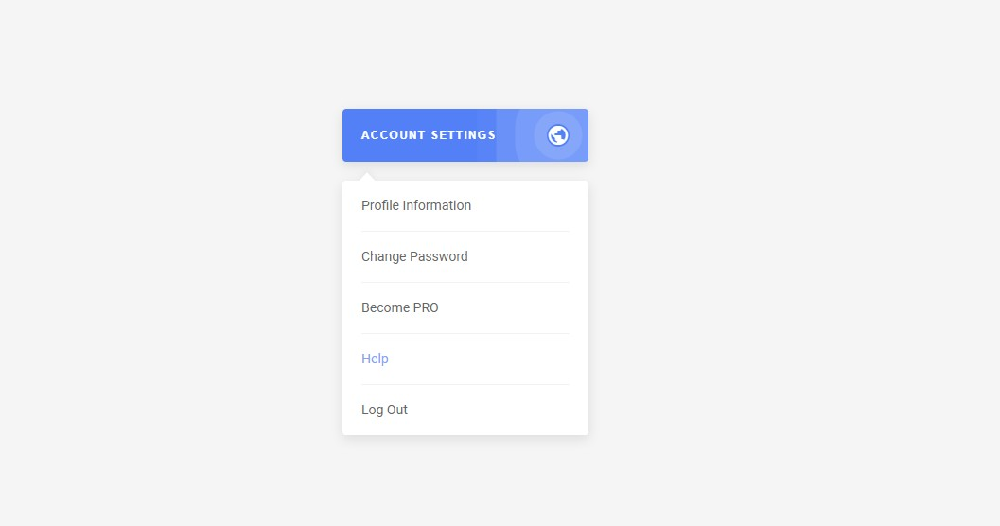

# Выпадающий список

Учебный проект курса [React для JS-разработчиков](https://netology.ru/programs/react)

## **Задача**

Создание компонента выпадающего списка

## **Описание проекта**

Структура компонентов:

- `Dropdown` — содержит кнопку и `DropdownList`, внутри себя хранит состояние, показывать или нет выпадающий список;
- `DropdownList` — содержит список `DropdownItem` и хранит информацию о текущем выбранном элементе.

Реализована следующая функциональность:

- При клике на кнопку показывается и скрывается выпадающее меню.
- Отрисовывается список на базе массива, хранящегося в памяти, через `map`.
- Подсвечивается выбранный элемент в списке.

## **Стек технологий**

## [**Демо**](https://dropdown-xi-ten.vercel.app/)

